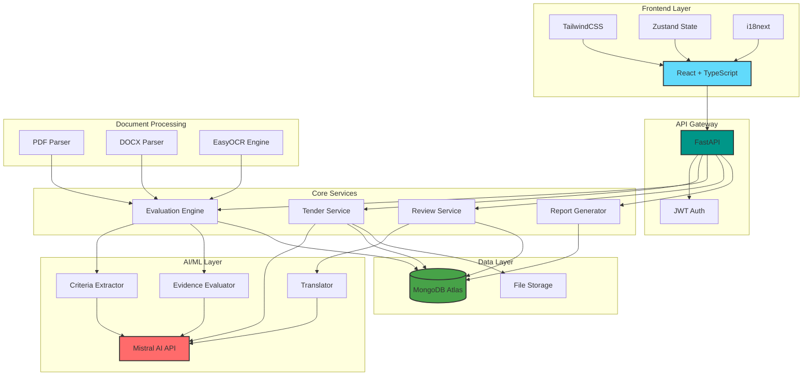
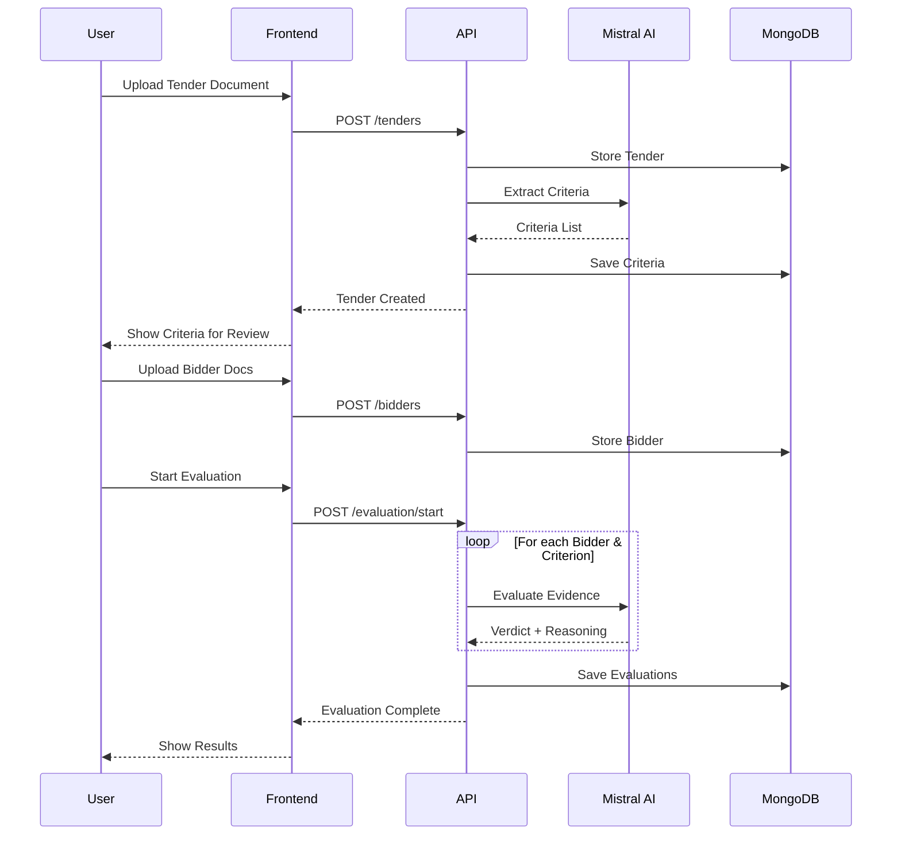

<div align="center">

<!-- Animated Title -->
<h1>
  
</h1>

<!-- Subtitle -->


<br/>
<br/>

<!-- Tech Stack Badges -->
<p align="center">
  
  
  
  
  
  
</p>

<!-- Navigation Links -->
<p align="center">
  <a href="#-features">Features</a> •
  <a href="#-quick-start">Quick Start</a> •
  <a href="#-documentation">Documentation</a> •
  <a href="#-contributing">Contributing</a> •
  <a href="#-license">License</a>
</p>

<br/>

<!-- Animated Description -->
<p align="center">
  
</p>

</div>

---

## 📖 Table of Contents

<details>
<summary>Click to expand</summary>

- [🌟 Overview](#-overview)
- [✨ Features](#-features)
- [🏗️ Architecture](#️-architecture)
- [🚀 Quick Start](#-quick-start)
- [📚 Documentation](#-documentation)
- [💡 Usage](#-usage)
- [🛠️ Technology Stack](#️-technology-stack)
- [📊 Project Structure](#-project-structure)
- [🔧 Configuration](#-configuration)
- [🧪 Testing](#-testing)
- [🌍 Internationalization](#-internationalization)
- [🔒 Security](#-security)
- [🐛 Troubleshooting](#-troubleshooting)
- [🗺️ Roadmap](#️-roadmap)
- [🤝 Contributing](#-contributing)
- [📄 License](#-license)
- [🙏 Acknowledgments](#-acknowledgments)
- [📧 Contact](#-contact)

</details>

---

<div align="center">

## 🌟 Overview

</div>

**NirnayAI** is a cutting-edge AI-powered tender evaluation system designed to revolutionize government procurement processes. By leveraging advanced artificial intelligence, natural language processing, and optical character recognition, NirnayAI automates the tedious task of evaluating tender bids, ensuring transparency, efficiency, and compliance.

<div align="center">

### 🎯 The Problem

</div>

Traditional tender evaluation processes are:
- ⏰ **Time-consuming** - Manual review of hundreds of pages
- 🔍 **Error-prone** - Human fatigue leads to inconsistencies
- 📊 **Opaque** - Difficult to track and audit decisions
- 💸 **Costly** - Requires significant manpower and resources

<div align="center">

### 💡 The Solution

</div>

NirnayAI transforms tender evaluation through:
- 🤖 **AI-Powered Analysis** - Automated criteria extraction and bidder evaluation
- ⚡ **Speed** - Process in minutes what takes days manually
- 🎯 **Accuracy** - Consistent, unbiased evaluation across all bidders
- 📝 **Transparency** - Complete audit trail and explainable AI decisions
- 🌐 **Multilingual** - Support for English, Hindi, and Kannada

---

<div align="center">

## ✨ Features


</div>

<table>
<tr>
<td width="50%">

### 🤖 AI-Powered Intelligence


- **🔍 Automated Criteria Extraction**
  - AI reads tender documents automatically
  - Identifies evaluation criteria with high accuracy
  - Supports multiple criterion types (numerical, date, certification)

- **📄 Smart Document Analysis**
  - Handles PDF, DOCX, and images
  - OCR for scanned documents
  - Multi-language document support

- **⚖️ Intelligent Evaluation**
  - AI evaluates bidders against requirements
  - Extracts evidence from submission documents
  - Provides detailed reasoning for each decision

- **🎚️ Confidence Scoring**
  - Built-in confidence bands
  - Automatic flagging for uncertain decisions
  - Human-in-the-loop for edge cases

</td>
<td width="50%">

### 📋 Procurement Management


- **📊 Tender Lifecycle Management**
  - Create and track tenders end-to-end
  - Status tracking through entire workflow
  - Deadline and milestone management

- **🏢 Bidder Management**
  - Upload and organize bidder submissions
  - Document version tracking
  - Multi-document support per bidder

- **🎯 Multi-Criteria Evaluation**
  - Support for diverse criterion types
  - Weighted scoring (if configured)
  - Complex eligibility rules

- **📈 Comparative Analysis**
  - Side-by-side bidder comparison
  - Visual dashboards and charts
  - Export to Excel and PDF

</td>
</tr>
<tr>
<td width="50%">

### 👥 Human-in-the-Loop


- **🔔 Review Queue**
  - Dedicated interface for uncertain cases
  - Priority-based review workflow
  - Smart notifications

- **✏️ Override System**
  - Officers can override AI decisions
  - Mandatory justification tracking
  - Full audit trail of human interventions

- **📝 Manual Editing**
  - Edit extracted criteria
  - Add custom requirements
  - Delete irrelevant auto-extracted items

- **🔐 Digital Approval**
  - Formal sign-off workflow
  - Multi-level approval (configurable)
  - Compliance documentation

</td>
<td width="50%">

### 🌐 Multilingual Support


- **🗣️ Three Languages**
  - 🇬🇧 English
  - 🇮🇳 हिंदी (Hindi)
  - 🇮🇳 ಕನ್ನಡ (Kannada)

- **🔄 AI-Powered Translation**
  - Dynamic translation of AI reasoning
  - Context-aware translations
  - Real-time language switching

- **🎨 Localized UI**
  - Complete interface translation
  - Culturally appropriate formatting
  - Right-to-left support (future)

- **📊 Multilingual Reports**
  - Generate reports in any language
  - Preserve formatting across languages
  - Export with proper encoding

</td>
</tr>
<tr>
<td colspan="2">

### 📊 Reporting & Compliance


<div align="center">

| Feature | Description | Format |
|---------|-------------|--------|
| **📄 Automated Reports** | Generate comprehensive evaluation reports | PDF, Excel, JSON |
| **🔏 Digital Sign-off** | Formal approval workflow with authentication | Secure & Tracked |
| **📋 Audit Logs** | Complete activity tracking for compliance | Real-time Logging |
| **📤 Export Capabilities** | Multiple export formats for integration | API & Downloads |
| **📊 Analytics Dashboard** | Visual insights into evaluation metrics | Interactive Charts |
| **⏱️ Timeline Tracking** | Track evaluation progress and deadlines | Gantt-style View |

</div>

</td>
</tr>
</table>

---

<div align="center">

## 🏗️ Architecture


</div>



<div align="center">

### 🔄 Data Flow

</div>



---

<div align="center">

## 🚀 Quick Start


</div>

### ⚡ Prerequisites Checklist

<table>
<tr><td>

**Required Software**

- [x] Python 3.9+ - [Download](https://python.org)
- [x] Node.js 18+ - [Download](https://nodejs.org)
- [x] Git - [Download](https://git-scm.com)

</td><td>

**API Accounts**

- [x] MongoDB Atlas - [Sign Up](https://mongodb.com/atlas)
- [x] Mistral AI - [Get API Key](https://console.mistral.ai)

</td></tr>
</table>

### 📦 Installation

<details open>
<summary><b>Step 1: Clone Repository</b></summary>

```bash
git clone https://github.com/yourusername/NirnayAI.git
cd NirnayAI
```

</details>

<details open>
<summary><b>Step 2: Backend Setup</b></summary>

```bash
# Navigate to backend
cd backend

# Create virtual environment
python -m venv venv

# Activate virtual environment
# Windows: venv\Scripts\activate
# macOS/Linux: source venv/bin/activate

# Install dependencies
pip install -r requirements.txt

# Configure environment
cp ../.env.example .env
# Edit .env with your API keys and credentials
```

**Generate SECRET_KEY:**
```bash
python -c "import secrets; print(secrets.token_hex(32))"
```

</details>

<details open>
<summary><b>Step 3: Frontend Setup</b></summary>

```bash
# Navigate to frontend
cd ../frontend

# Install dependencies
npm install
```

</details>

<details open>
<summary><b>Step 4: Database Setup</b></summary>

```bash
# Seed demo data
cd ../mock-data
python seed_database.py
```

**Demo Credentials Created:**
- Username: `officer`
- Password: `Officer@123`

</details>

<details open>
<summary><b>Step 5: Launch Application</b></summary>

**Terminal 1 - Backend:**
```bash
cd backend
uvicorn app.main:app --reload
```

**Terminal 2 - Frontend:**
```bash
cd frontend
npm run dev
```

</details>

### 🎉 Success!

<div align="center">

**Frontend:** [http://localhost:5173](http://localhost:5173)

**Backend API:** [http://localhost:8000](http://localhost:8000)

**API Docs:** [http://localhost:8000/docs](http://localhost:8000/docs)

</div>

> 💡 **Pro Tip:** Check out [SETUP_INSTRUCTIONS.md](SETUP_INSTRUCTIONS.md) for detailed setup guide with troubleshooting!

---

## 📚 Documentation

| Guide | Description |
|---|---|
| [Setup Guide](SETUP_INSTRUCTIONS.md) | Detailed installation and configuration instructions |
| [Testing Guide](MANUAL_TESTING_GUIDE.md) | Manual testing scenarios and test cases |

---

## 💡 Usage

### Complete Workflow

```
Upload Tender → AI Extracts Criteria → Review & Edit → Add Bidders
     → Upload Submissions → Run AI Evaluation → Human Review (if needed)
     → Generate Report → Digital Sign-off → Complete
```

### Step-by-Step Guide

**1. Login to system**

```
URL:      http://localhost:5173
Username: officer
Password: Officer@123
```

**2. Upload tender document**

- Click **"Upload New Tender"**
- Fill in tender details
- Upload PDF/DOCX tender document
- AI automatically extracts evaluation criteria

**3. Review extracted criteria**

- Review AI-extracted criteria
- Edit descriptions or requirements
- Add custom criteria if needed
- Delete irrelevant ones
- Click **"Confirm These Requirements"**

**4. Add bidder submissions**

- Open tender details
- Click **"Add Company"**
- Enter bidder name
- Upload their submission documents
- Repeat for all bidders

**5. Run AI evaluation**

- Navigate to the **"Evaluate"** tab
- Click **"Start Evaluation"**
- Wait for AI to process all bidders
- View results: Eligible ✅ / Ineligible ❌ / Needs Review ⚠️

**6. Review edge cases**

- Go to **"Review Queue"**
- Check items flagged for human review
- Read AI reasoning and evidence
- Accept or override decision
- Provide justification for overrides

**7. Generate final report**

- Navigate to **"Reports"**
- Review evaluation summary
- Download PDF or Excel report
- Complete digital sign-off
- Mark tender as complete

---

## 🛠️ Technology Stack

### Frontend

| Category | Technologies |
|---|---|
| Core Framework | React 18.3.1, TypeScript 5.3.3, Vite 5.0.8 |
| Styling & UI | TailwindCSS 3.4.1, Framer Motion 10.16.16, Lucide React Icons |
| State & Routing | Zustand 4.4.2, React Router v6, Axios |
| Internationalization | i18next 23.7.6, react-i18next 14.0.0, 3 language support |

### Backend

| Category | Technologies |
|---|---|
| Core Framework | Python 3.9+, FastAPI 0.111.0, Uvicorn 0.29.0 |
| Database | MongoDB Atlas, Motor (async driver), PyMongo 4.7.2 |
| AI & ML | Mistral AI API, EasyOCR 1.7.1, PyMuPDF, python-docx |
| Security & Auth | JWT (python-jose), bcrypt password hashing, Passlib |

### Data & Reports

| Category | Technologies |
|---|---|
| Report Generation | ReportLab (PDF), OpenPyXL (Excel), JSON Export |
| Document Processing | PyMuPDF (PDF parsing), python-docx (Word docs), Pillow (images) |
| Utilities | Pydantic Settings, python-dotenv, aiofiles, httpx |

---

## 📂 Project Structure

```
NirnayAI/
├── backend/
│   ├── app/
│   │   ├── ai/                    # AI evaluation engine
│   │   │   ├── mistral_client.py
│   │   │   ├── criteria_extractor.py
│   │   │   ├── evidence_evaluator.py
│   │   │   ├── confidence_bands.py
│   │   │   └── prompts/           # AI prompt templates
│   │   ├── auth/                  # Authentication & JWT
│   │   │   ├── router.py
│   │   │   ├── service.py
│   │   │   └── dependencies.py
│   │   ├── tenders/               # Tender management
│   │   │   ├── router.py
│   │   │   ├── service.py
│   │   │   └── models.py
│   │   ├── bidders/               # Bidder management
│   │   │   ├── router.py
│   │   │   └── service.py
│   │   ├── documents/             # Document processing
│   │   │   ├── parsers/
│   │   │   ├── ocr/
│   │   │   ├── service.py
│   │   │   └── storage.py
│   │   ├── evaluation/            # Evaluation logic
│   │   │   ├── router.py
│   │   │   ├── tasks.py
│   │   │   └── completeness.py
│   │   ├── review/                # Human review system
│   │   │   └── router.py
│   │   ├── reports/               # Report generation
│   │   │   ├── pdf_generator.py
│   │   │   ├── excel_generator.py
│   │   │   └── json_generator.py
│   │   ├── audit/                 # Audit logging
│   │   │   ├── router.py
│   │   │   └── service.py
│   │   ├── i18n/                  # Internationalization
│   │   │   ├── router.py
│   │   │   └── translator.py
│   │   ├── jobs/                  # Background jobs
│   │   │   ├── router.py
│   │   │   ├── service.py
│   │   │   └── sse.py
│   │   ├── main.py
│   │   ├── config.py
│   │   ├── database.py
│   │   └── models.py
│   └── requirements.txt
│
├── frontend/
│   ├── src/
│   │   ├── components/
│   │   │   ├── layouts/
│   │   │   │   └── MainLayout.tsx
│   │   │   ├── Navbar.tsx
│   │   │   ├── Sidebar.tsx
│   │   │   ├── StatCard.tsx
│   │   │   ├── LanguageSwitcher.tsx
│   │   │   └── ProtectedRoute.tsx
│   │   ├── pages/
│   │   │   ├── LandingPage.tsx
│   │   │   ├── LoginPage.tsx
│   │   │   ├── RegisterPage.tsx
│   │   │   ├── Dashboard.tsx
│   │   │   ├── TendersPage.tsx
│   │   │   ├── TenderDetailPage.tsx
│   │   │   ├── EvaluationPage.tsx
│   │   │   ├── ReviewQueuePage.tsx
│   │   │   ├── ReportsPage.tsx
│   │   │   └── AuditLogsPage.tsx
│   │   ├── services/
│   │   │   └── api.ts
│   │   ├── stores/
│   │   │   └── authStore.ts
│   │   ├── i18n/
│   │   │   ├── config.ts
│   │   │   └── locales/
│   │   │       ├── en.json
│   │   │       ├── hi.json
│   │   │       └── kn.json
│   │   ├── App.tsx
│   │   └── main.tsx
│   ├── package.json
│   ├── tailwind.config.ts
│   ├── vite.config.ts
│   └── tsconfig.json
│
├── mock-data/
│   └── seed_database.py
├── sample-files/
│   ├── 00_Sample_Tender_SmartCity.docx
│   ├── 01_Bidder_TechNova_Eligible.docx
│   └── 02_Bidder_UrbanBuild_UnderReview.docx
├── .env.example
├── .gitignore
├── README.md
├── SETUP_INSTRUCTIONS.md
└── MANUAL_TESTING_GUIDE.md
```

---

## 🔧 Configuration

Create a `.env` file in the project root:

```bash
# Mistral AI — https://console.mistral.ai
MISTRAL_API_KEY=your_mistral_api_key_here
MISTRAL_MODEL_LARGE=mistral-large-latest
MISTRAL_MODEL_SMALL=mistral-small-latest

# MongoDB — https://mongodb.com/atlas
MONGODB_URL=mongodb+srv://<username>:<password>@cluster.mongodb.net/
DB_NAME=nirnayai

# Security — generate with: python -c "import secrets; print(secrets.token_hex(32))"
SECRET_KEY=your_64_character_hex_secret_key
ALGORITHM=HS256
ACCESS_TOKEN_EXPIRE_MINUTES=480

# OCR
OCR_LANGUAGES=en,hi
OCR_CONFIDENCE_THRESHOLD=0.70
OCR_USE_GPU=false

# AI thresholds — lower = more AI decisions, higher = more human reviews
LLM_CONFIDENCE_THRESHOLD=0.75

# File uploads
UPLOAD_DIR=./uploads
MAX_FILE_SIZE_MB=50

# Application
APP_ENV=development
CORS_ORIGINS=http://localhost:5173
APP_HOST=0.0.0.0
APP_PORT=8000
```

---

## 🧪 Testing

Follow the comprehensive testing guide: [MANUAL_TESTING_GUIDE.md](MANUAL_TESTING_GUIDE.md)

**Test with sample files:**

```
1. Upload:     sample-files/00_Sample_Tender_SmartCity.docx
2. Add bidder: sample-files/01_Bidder_TechNova_Eligible.docx
3. Add bidder: sample-files/02_Bidder_UrbanBuild_UnderReview.docx
4. Run evaluation and review results
```

Interactive API documentation: [http://localhost:8000/docs](http://localhost:8000/docs)

---

## 🌍 Internationalization

NirnayAI supports three languages with complete UI and content translation:

| Language | Script | Notes |
|---|---|---|
| 🇬🇧 English | Latin | Default language, full UI and AI reasoning support |
| 🇮🇳 Hindi (हिंदी) | Devanagari | AI-powered translation |
| 🇮🇳 Kannada (ಕನ್ನಡ) | Kannada | Dynamic content translation |

**Translation coverage:** UI, AI reasoning, error messages, report generation, email notifications (future)

---

## 🔒 Security

| Area | Features |
|---|---|
| Authentication | JWT-based auth, bcrypt password hashing, token expiration, refresh token support |
| Data protection | MongoDB encryption at rest, HTTPS (production), CORS protection, SQL injection prevention |
| Audit & compliance | Complete activity logging, user action tracking, compliance reports, timestamp verification |
| File security | File type validation, size restrictions, secure storage, malware scanning (future) |

**Best practices:**
- Never commit `.env` to version control
- Rotate `SECRET_KEY` regularly in production
- Use strong passwords for MongoDB
- Enable MongoDB IP whitelisting
- Keep dependencies updated
- Monitor audit logs regularly

---

## 🐛 Troubleshooting

**MongoDB connection failed**

1. Verify connection string in `.env`
2. Check MongoDB Atlas IP whitelist
3. Ensure username/password are correct
4. Test: `python -c "from motor.motor_asyncio import AsyncIOMotorClient; import asyncio; asyncio.run(AsyncIOMotorClient('YOUR_URL').admin.command('ping'))"`

**Mistral AI authentication error**

1. Verify API key in `.env`
2. Check account credits at console.mistral.ai
3. Ensure model names are correct
4. Test: `curl https://api.mistral.ai/v1/models -H "Authorization: Bearer YOUR_KEY"`

**Port already in use**

```bash
# Linux/Mac
lsof -ti:8000 | xargs kill -9

# Windows
netstat -ano | findstr :8000

# Or use a different port
uvicorn app.main:app --port 8001
```

**CORS errors**

1. Verify `CORS_ORIGINS` in `.env` matches the frontend URL
2. Ensure both servers are running
3. Clear browser cache and check the browser console

**OCR models not downloading**

1. Ensure stable internet connection
2. Models auto-download on first use (~500 MB)
3. Check `~/.EasyOCR/model/` has write permissions
4. Manually download from [EasyOCR GitHub](https://github.com/JaidedAI/EasyOCR)

**Frontend build errors**

```bash
cd frontend
rm -rf node_modules package-lock.json
npm cache clean --force
npm install
```

---

## 🗺️ Roadmap

### Phase 1 — Current (v1.0)

- [x] AI-powered criteria extraction
- [x] Automated bidder evaluation
- [x] Human review queue
- [x] Multilingual support (EN, HI, KN)
- [x] PDF & Excel report generation
- [x] Complete audit trail

### Phase 2 — Enhancement (v1.5)

- [ ] Email notifications — automated alerts for evaluation events
- [ ] Advanced analytics — deep insights dashboard with charts
- [ ] Real-time collaboration — multiple users working simultaneously
- [ ] Mobile app — iOS and Android native apps
- [ ] Custom templates — configurable report templates
- [ ] Advanced search — full-text search across documents

### Phase 3 — Integration (v2.0)

- [ ] E-procurement integration — connect with government portals
- [ ] Blockchain audit trail — immutable records
- [ ] Advanced AI models — specialized domain models
- [ ] More file formats — Excel, CSV, XML support
- [ ] More languages — Tamil, Telugu, Bengali support
- [ ] SSO integration — single sign-on with government systems

### Phase 4 — Scale (v3.0)

- [ ] Cloud-native deployment — Kubernetes orchestration
- [ ] Performance optimization — handle 1000+ concurrent users
- [ ] Workflow automation — custom approval workflows
- [ ] BI integration — Power BI, Tableau connectors
- [ ] Training portal — built-in user training modules
- [ ] Multi-tenancy — support multiple organizations

---

## 🙏 Acknowledgments

| Library | Purpose |
|---|---|
| [Mistral AI](https://mistral.ai) | Advanced AI evaluation engine |
| [MongoDB](https://mongodb.com) | Flexible, scalable database |
| [FastAPI](https://fastapi.tiangolo.com) | High-performance web framework |
| [React](https://react.dev) | UI library |
| [EasyOCR](https://github.com/JaidedAI/EasyOCR) | Optical character recognition |
| [TailwindCSS](https://tailwindcss.com) | Styling |
| [Zustand](https://github.com/pmndrs/zustand) | State management |
| [i18next](https://www.i18next.com) | Internationalization |
| [ReportLab](https://www.reportlab.com) | PDF generation |
| [python-jose](https://github.com/mpdavis/python-jose) | JWT authentication |

---

## 📧 Contact

**Project Maintainer:** Vibha Kashyap

- Email: kashyapvib@gmail.com
- GitHub: [Vibhakash](https://github.com/Vibhakash)
- LinkedIn: [Vibha Kashyap](https://www.linkedin.com/in/vibha-kashyap-b89517313)

---

## 📄 License

This project is licensed under the **MIT License**.

```
MIT License

Copyright (c) 2024 NirnayAI Contributors

Permission is hereby granted, free of charge, to any person obtaining a copy
of this software and associated documentation files (the "Software"), to deal
in the Software without restriction, including without limitation the rights
to use, copy, modify, merge, publish, distribute, sublicense, and/or sell
copies of the Software, and to permit persons to whom the Software is
furnished to do so, subject to the following conditions:

The above copyright notice and this permission notice shall be included in all
copies or substantial portions of the Software.

THE SOFTWARE IS PROVIDED "AS IS", WITHOUT WARRANTY OF ANY KIND, EXPRESS OR
IMPLIED, INCLUDING BUT NOT LIMITED TO THE WARRANTIES OF MERCHANTABILITY,
FITNESS FOR A PARTICULAR PURPOSE AND NONINFRINGEMENT.
```

---

*NirnayAI © 2024 — Transforming Government Procurement with AI*